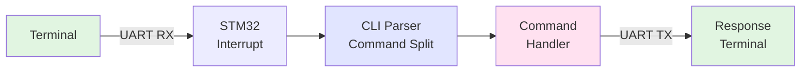

# STM32 Serial Shell - CLI with JSON Support

An interactive command-line interface for STM32 that processes commands over UART. Built to understand embedded parsers and driver architecture.

## What It Does

Type commands in a serial terminal → STM32 processes them → Executes actions → Responds back

**Example Commands:**
```bash
help
set led on
get status
```

Can also accept JSON format for structured commands.

## System Flow



**Flow Details:**
1. UART receives data byte-by-byte via interrupts
2. CLI parser extracts command and parameters
3. Registered handler executes the command
4. Response formatted and sent back via UART

## Architecture

**Clean 3-Layer Design:**

- **uart.c/h** - Hardware driver (interrupts, state machine, error handling)
- **em-cli.c/h** - Command parser (registration, parameter extraction)
- **jsmn.c/h** - JSON parser (optional, for JSON commands)
- **main.c** - Application (command handlers, main loop)

## Key Features

✅ Interrupt-driven UART (non-blocking)  
✅ Command registration system  
✅ Built-in commands: `help`, `set`, `get`  
✅ JSON parsing support with JSMN  
✅ Zero dynamic memory allocation  
✅ Error detection & recovery  

## Quick Start

**Hardware:** STM32G0 + USB-UART adapter

```bash
# Clone repo
git clone https://github.com/BlackWiz/STM32-Serial-Shell.git

# Build and flash to STM32
# Connect serial terminal
screen /dev/ttyUSB0 9600
```

**Try it:**
```
> help
> set test 123
> get test
```

## Adding Your Command

```c
// Define handler
base_type my_cmd_handler(char *out, size_t len, const char *cmd) {
    sprintf(out, "Custom response\r\n");
    return CLI_FALSE;
}

// Define command
const cli_command_definition_t my_cmd = {
    "mycmd",
    "My custom command",
    my_cmd_handler,
    0  // parameter count
};

// Register in main
cli_register_command(&my_cmd);
```

## Technical Notes

**UART State Machine:**
- IDLE → TX_BUSY → IDLE
- IDLE → RX_BUSY → IDLE  
- Error states with recovery

**Memory Safety:**
- Fixed buffers (no malloc)
- Bounds checking on all inputs
- Stack-aware design

**Built for learning:**
- Driver/app separation
- Real hardware tested
- No HAL dependencies

---

**STM32G0 | UART (9600 baud) | Bare-metal C | No simulation lies**
